# 프로젝트 시연 영상

##### 이미지를 누르면 시연영상을 확인할 수 있습니다.

  

# 페이지

## 1. 메인 화면
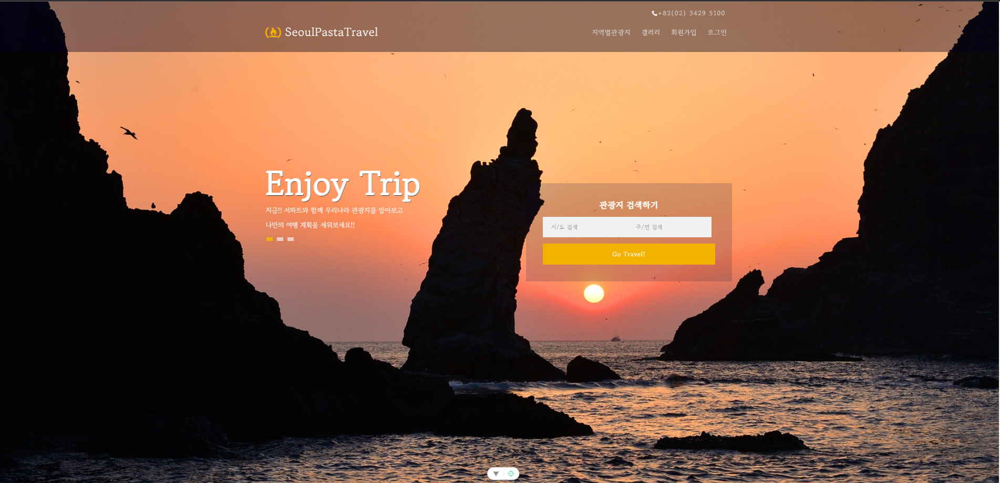

## 2. 회원가입 화면

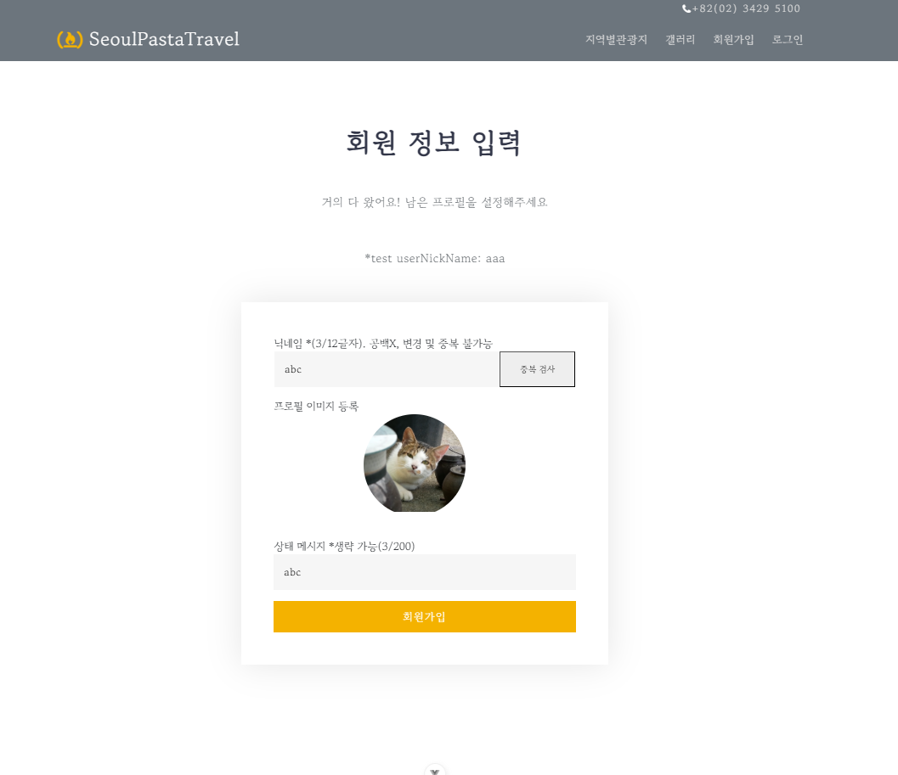

## 3. 로그인 화면
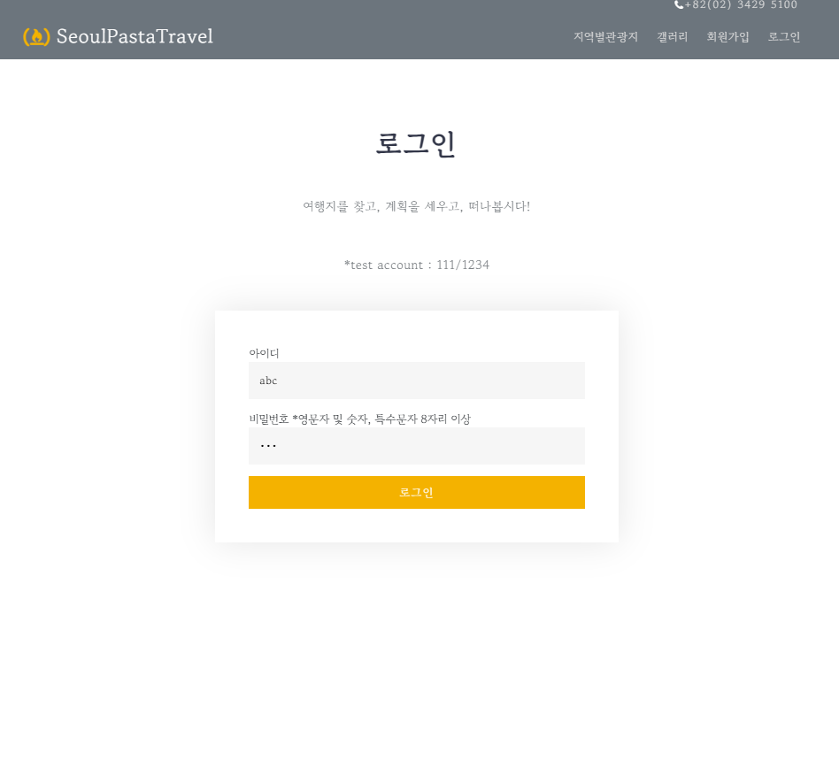

## 4. 프로필 화면
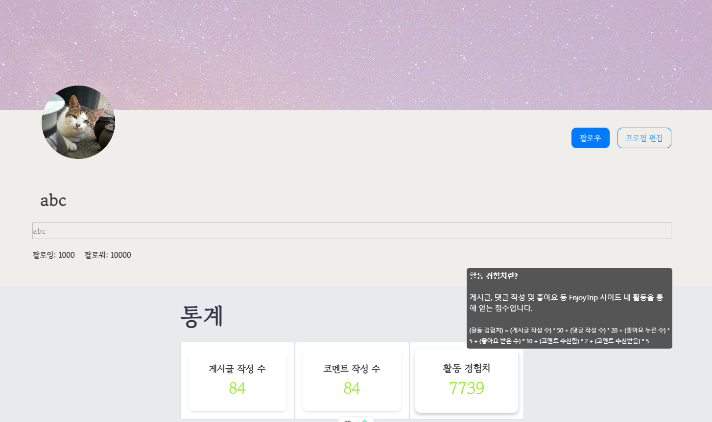

## 5. 갤러리 화면

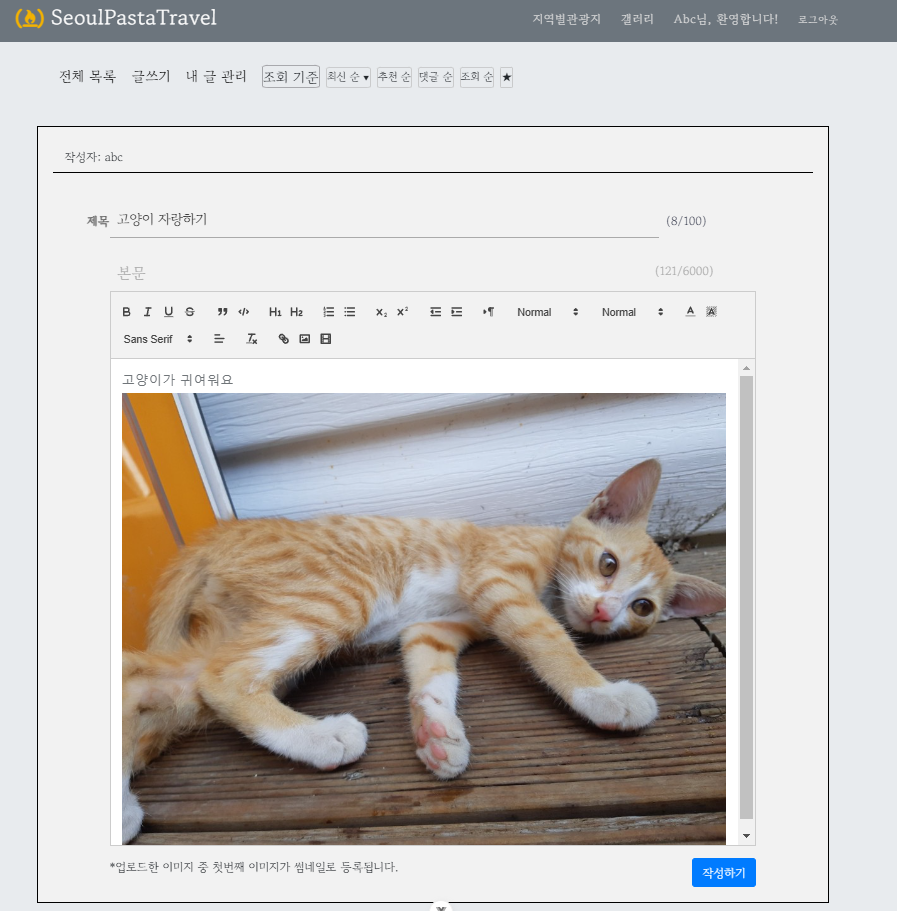
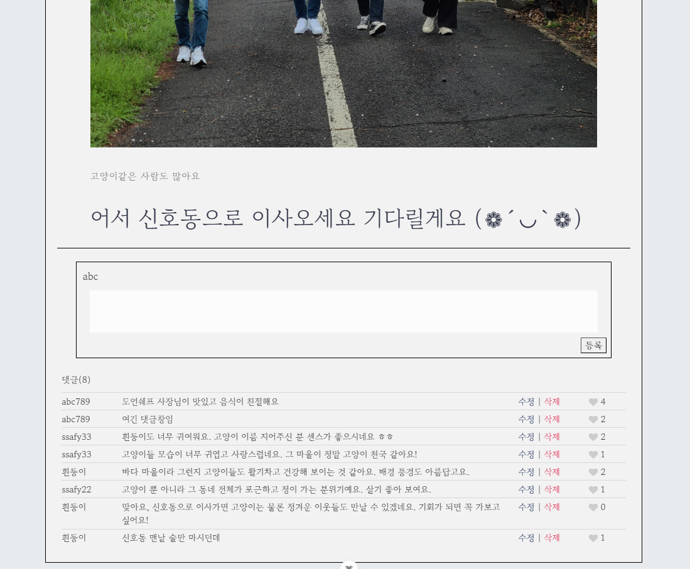

## 6. 관광지 맵 화면
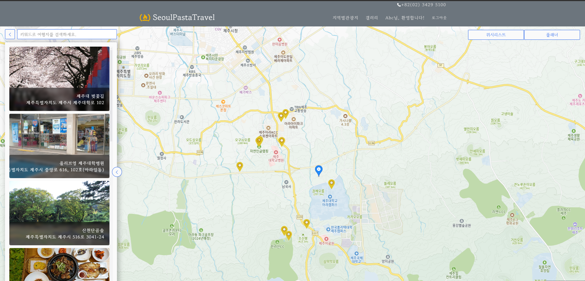

## 7. 관광지 리뷰 화면
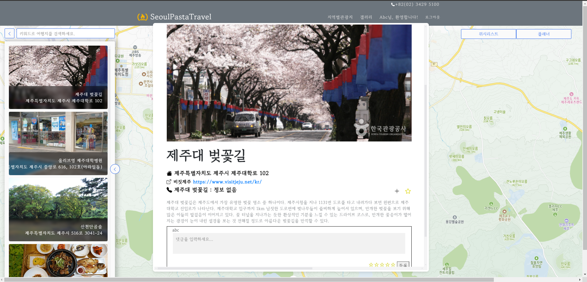
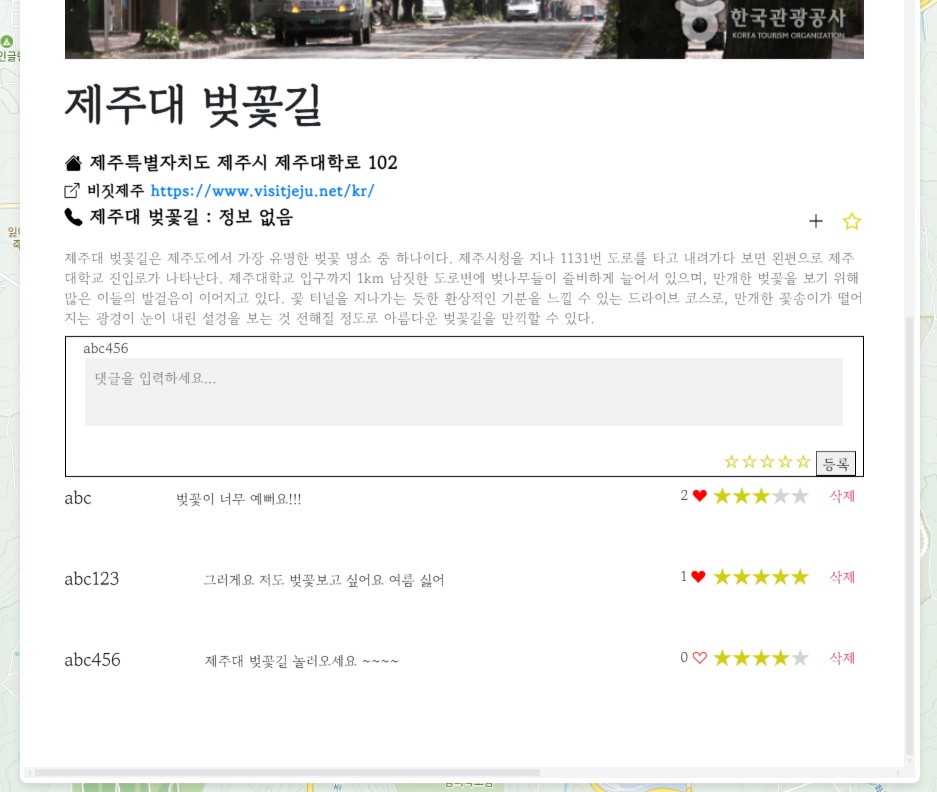

## 8. 위시리스트 화면
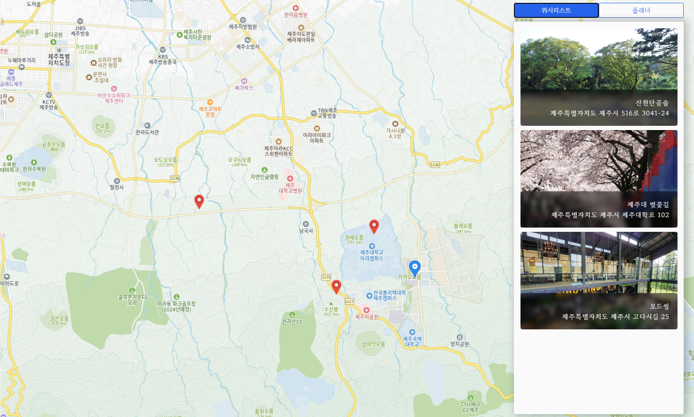

## 9. 플래너 화면

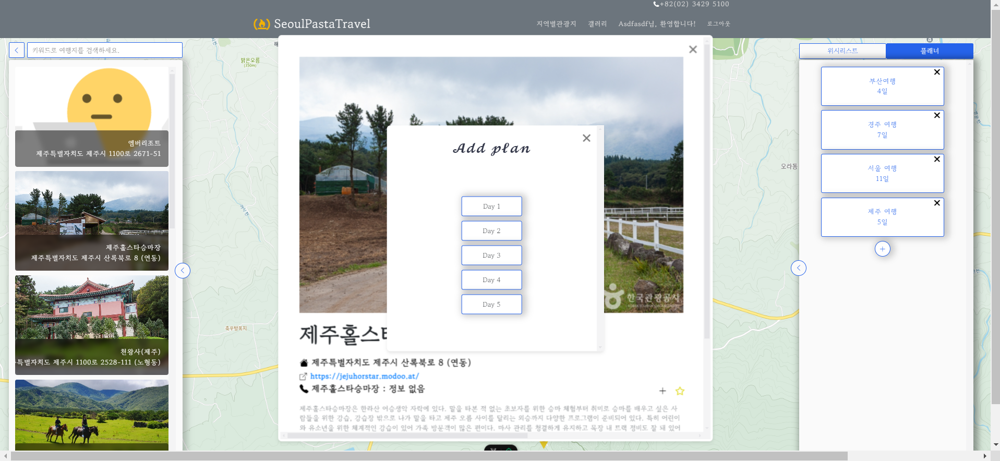
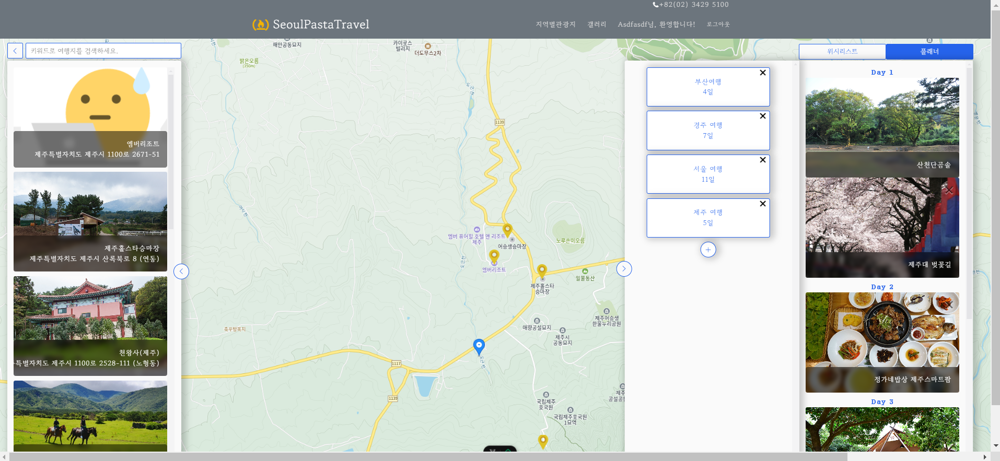
